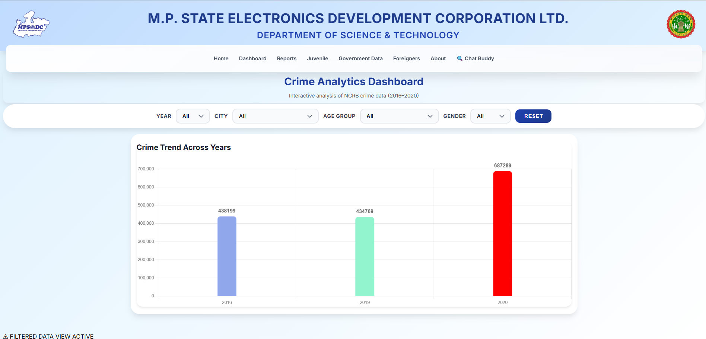
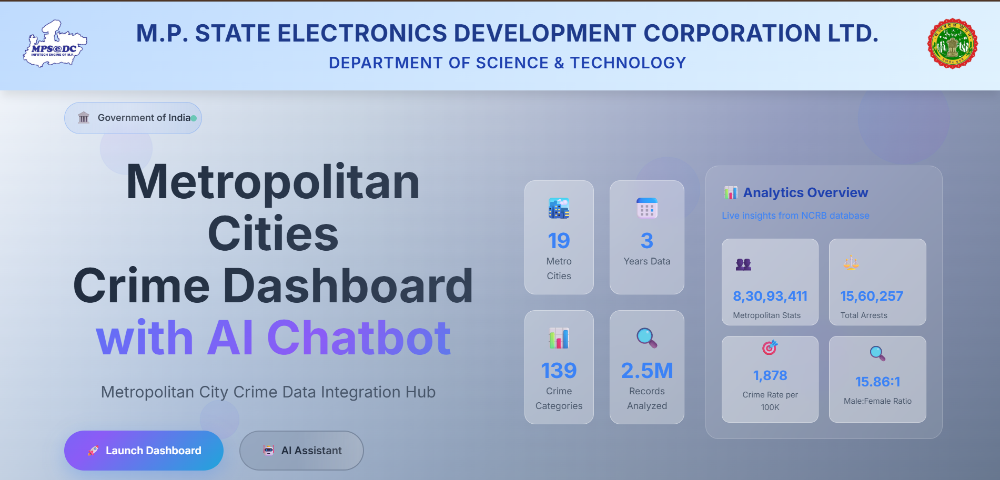
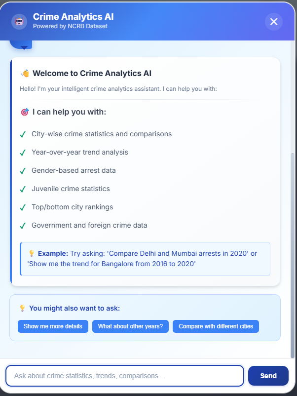
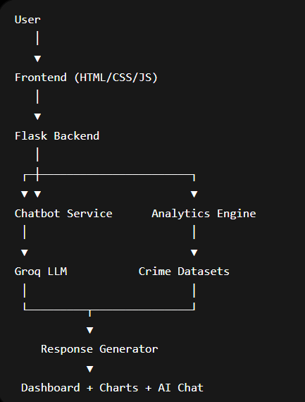

# 🏙️ Metropolitan Cities Crime Statistics Dashboard with AI Chatbot

<p align="center">
  
</p>

<p align="center">
  
  
  
  
</p>

## 🚀 Overview

Metropolitan Cities Crime Statistics Dashboard is an AI-powered crime analytics platform that enables users to explore and analyze crime statistics across major metropolitan cities in India using natural language queries.

The platform combines data visualization, crime analytics, and conversational AI to provide insights from NCRB datasets through an intuitive web interface.

---

## 🌟 Key Features

### 🤖 AI Chatbot

- Natural language crime data queries
- Context-aware conversations
- Typo correction and smart query understanding
- City abbreviation support
- Follow-up question suggestions
- Groq LLM integration

### 📊 Crime Analytics

- City-wise crime analysis
- Arrest statistics visualization
- Gender-based crime analytics
- Crime trend analysis
- Year-over-year comparisons
- Top and bottom city rankings

### ⚡ Performance Optimization

- Intelligent response caching
- Fast query execution
- Session-based conversation memory
- Smart error recovery system

### 📈 Interactive Dashboard

- Charts and visualizations
- Comparative analysis
- Dynamic filtering
- Responsive UI

---

# 📸 Screenshots

## 🏠 Landing Page



---

## 📊 Crime Analytics Dashboard

Interactive visualization of NCRB crime statistics across metropolitan cities.


---

## 🤖 AI Crime Analytics Chatbot

Natural language interface powered by Groq LLM for crime data exploration.



---

## 🏗️ System Architecture



# 🎥 Demo


https://github.com/user-attachments/assets/53bb4437-ede3-4751-8056-4df0359413dc

---

# 🏗️ System Architecture


---

# 🛠️ Tech Stack

## Backend

- Python
- Flask
- Pandas
- NumPy
- Gunicorn

## AI & NLP

- Groq API
- Custom Query Processing
- Fuzzy Matching

## Frontend

- HTML5
- CSS3
- JavaScript
- Chart.js
- Leaflet.js

## Database & Storage

- SQLite
- CSV Datasets

## Deployment

- Render
- Railway
- PythonAnywhere

---

# 📂 Project Structure

```text
Metropolitan-Crime-Dashboard/
│
├── app.py
├── config.py
├── wsgi.py
├── requirements.txt
├── Procfile
│
├── chat/
├── services/
├── routes/
├── templates/
├── static/
├── data/
│
├── screenshots/
│   ├── dashboard.png
│   ├── chatbot.png
│   ├── analytics.png
│   ├── comparison.png
│   └── architecture.png
│
└── README.md
```

---

# 🔍 Example Queries

```text
Delhi arrests 2020

Compare Delhi and Mumbai

Top 5 cities by arrests

Female arrests in Chennai

Delhi trend from 2016 to 2020

Foreign crime statistics

Juvenile crime in Bangalore
```

---

# 🚀 Installation

## Clone Repository

```bash
git clone https://github.com/ArunRajoriya/Metropolitan-Cities-Crime-Statistics-Dashboard-with-ChatBot.git

cd Metropolitan-Cities-Crime-Statistics-Dashboard-with-ChatBot
```

## Create Virtual Environment

```bash
python -m venv venv
```

### Windows

```bash
venv\Scripts\activate
```

### Linux / Mac

```bash
source venv/bin/activate
```

## Install Dependencies

```bash
pip install -r requirements.txt
```

---

# ⚙️ Environment Variables

Create a `.env` file:

```env
SECRET_KEY=your_secret_key
GROQ_API_KEY=your_groq_api_key
```

---

# ▶️ Run Locally

```bash
python app.py
```

Application runs at:

```text
http://localhost:5000
```

---

# 🌐 Deployment

## Render (Recommended)

### Procfile

```text
web: gunicorn wsgi:app
```

### wsgi.py

```python
from app import app

if __name__ == "__main__":
    app.run()
```

### render.yaml

```yaml
services:
  - type: web
    name: metropolitan-crime-dashboard
    runtime: python

    buildCommand: pip install -r requirements.txt

    startCommand: gunicorn wsgi:app

    envVars:
      - key: SECRET_KEY
        generateValue: true

      - key: GROQ_API_KEY
        sync: false
```

---

# 📡 API Endpoints

| Method | Endpoint | Description |
|----------|----------|-------------|
| POST | `/chat` | Chat with AI |
| GET | `/chat/analytics` | Analytics Dashboard |
| POST | `/chat/autocomplete` | Query Suggestions |
| POST | `/chat/context/clear` | Clear Session Context |

---

# 📊 Dataset Information

The dashboard uses NCRB (National Crime Records Bureau) datasets including:

- Metropolitan Crime Data
- Government Crime Statistics
- Juvenile Crime Data
- Foreign Offender Data

Coverage:

- 19 Metropolitan Cities
- Multiple Crime Categories
- Multi-year Analysis

---

# 🎯 Resume Highlights

- Built an AI-powered crime analytics platform using Flask and Groq LLM.
- Developed context-aware chatbot capable of natural language querying.
- Implemented caching and query optimization for faster responses.
- Visualized large-scale NCRB crime datasets using interactive dashboards.
- Designed scalable backend architecture with modular services.

---

# 👨‍💻 Author

**Arun Rajoriya**

GitHub:
https://github.com/ArunRajoriya

LinkedIn:
(Add Your LinkedIn URL)

---

# ⭐ Support

If you found this project useful, consider giving it a star on GitHub.

---

## 📜 License

This project is intended for educational and research purposes.